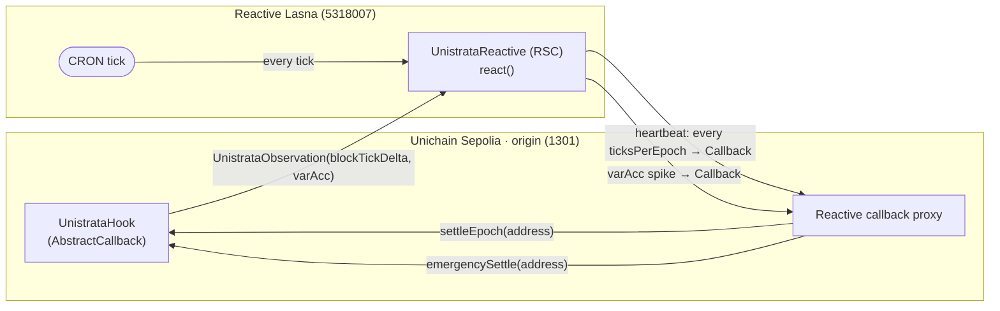

# Unistrata × Reactive Network — runbook

Unistrata's epoch settlement and volatility circuit breaker run with **zero off-chain infrastructure**:
a single Reactive Smart Contract (`UnistrataReactive`) on Reactive Lasna drives the origin-chain
`UnistrataHook`. No keepers, no bots, no Gelato/Chainlink Automation.



## Verified addresses (re-confirm on-chain before deploying — `cast code <addr> --rpc-url <chain>`)

| Item | Value |
|---|---|
| Origin chain | Unichain Sepolia — chainId **1301** |
| v4 PoolManager (origin) | `0x00B036B58a818B1BC34d502D3fE730Db729e62AC` |
| Reactive callback proxy (origin) | `0x9299472A6399Fd1027ebF067571Eb3e3D7837FC4` |
| Reactive testnet | Lasna — chainId **5318007**, RPC `https://lasna-rpc.rnk.dev/` |
| Reactive system contract | `0x…fffFfF` |
| reactive-lib | `Reactive-Network/reactive-lib@v0.2.0` |
| CRON topic (Cron100 ≈ 12 min) | `0xb49937fb8970e19fd46d48f7e3fb00d659deac0347f79cd7cb542f0fc1503c70` |

> ⚠️ A conflicting ETH Sepolia callback proxy surfaced in one search snippet; the values above are from
> the official docs table. CRON topic hashes are from the demos README — re-confirm against the live
> system contract on Lasna at deploy time.

## How the two triggers work

- **Heartbeat (routine settlement).** The RSC subscribes to the CRON event on Lasna and counts ticks;
  every `ticksPerEpoch` ticks it emits a `Callback` → `UnistrataHook.settleEpoch(address)`. The hook's
  callback path requires the epoch to have elapsed; a **permissionless `settleEpoch()`** fallback lets
  anyone settle after `epochEnd + gracePeriod`, so the demo never bricks on a missed callback.
- **Circuit breaker (the wow moment).** The hook emits `UnistrataObservation(blockTickDelta, varAcc)` from
  `afterSwap` on every new-block observation. The RSC subscribes to it; when cumulative `varAcc` jumps
  past `spikeThreshold` it emits a `Callback` → `UnistrataHook.emergencySettle(address)`, settling the
  epoch **early** (pro-rata) to lock in the bedrock coupon before further drawdown — and resets its CRON
  counter so the heartbeat stays in epoch-sync.

Callback authorization: `settleEpoch(address)` / `emergencySettle(address)` are `authorizedSenderOnly`
(the callback proxy) + `rvmIdOnly`. Deploy the hook and the RSC **from the same EOA** so the hook's
stored `rvm_id` matches the callbacks the RSC originates.

## Deploy sequence

Each script **writes its deployed addresses to `.env`** (`TOKEN_WETH`/`TOKEN_USDC` → `UNISTRATA_HOOK` →
`UNISTRATA_REACTIVE`) via an idempotent upsert, and `forge` **auto-loads `.env`** at startup — so each
step reads what the previous one wrote. No manual address copy-paste. (`.env` is gitignored.)

```bash
# 0. Demo pool tokens — tWETH (18 dec) + tUSDC (6 dec), minted to your deployer.
#    → writes TOKEN_WETH, TOKEN_USDC to .env
forge script script/unistrata/00_DeployMockTokens.s.sol \
  --rpc-url $UNICHAIN_SEPOLIA_RPC --account $ACCOUNT --sender $SENDER --broadcast

# 1. Hook + pool on the origin chain. Reads TOKEN_WETH/TOKEN_USDC from .env; mines the flag address;
#    DERIVES decimals/numéraire/init-price (v4 sorts by address) at 1 tWETH = TARGET_PRICE tUSDC
#    (default 3000). → writes UNISTRATA_HOOK to .env
[TARGET_PRICE=3000] forge script script/unistrata/01_DeployUnistrata.s.sol \
  --rpc-url $UNICHAIN_SEPOLIA_RPC --account $ACCOUNT --sender $SENDER --broadcast

# 2. RSC on Lasna (constructor registers both subscriptions = "deploy is subscribe"). Reads
#    UNISTRATA_HOOK from .env. → writes UNISTRATA_REACTIVE to .env
forge script script/unistrata/02_DeployReactive.s.sol \
  --rpc-url https://lasna-rpc.rnk.dev/ --account $ACCOUNT --sender $SENDER --broadcast

# 3. Fund BOTH chains in one multichain run (default run()): the hook on Unichain Sepolia via the
#    callback proxy AND the RSC on Lasna. The script selects each chain with its own fork, so pass
#    NO --rpc-url. Amounts are integer wei. Reads UNISTRATA_HOOK/UNISTRATA_REACTIVE from .env.
HOOK_FUNDING_WEI=50000000000000000 RSC_FUNDING_WEI=5000000000000000000 \
  forge script script/unistrata/03_FundAndSubscribe.s.sol \
  --account $ACCOUNT --sender $SENDER --broadcast
# (add --multi only when later doing --resume / --verify; broadcasts land under broadcast/multi/)

# 3 (alt). Single-chain top-ups — pass --sig + the matching --rpc-url:
#   forge script .. --sig "fundHook()"     --rpc-url unichain_sep   --broadcast --account $ACCOUNT ...
#   forge script .. --sig "fundReactive()" --rpc-url reactive_lasna --broadcast --account $ACCOUNT ...
```

Funding model: the callback proxy fronts gas on the origin chain and bills the hook as **debt** (min
callback gas limit 100,000); `depositTo(hook)` pre-funds and settles debt. Leave the hook funded with
native gas or it gets **blocklisted** until the debt clears. Determine the right pre-fund amount
empirically on testnet (no published minimum beyond the gas floor).

## Live testnet deployment (Phase 4)

> **Redeploying fresh as Unistrata.** An earlier pilot under the working name *Strata* already validated
> the full cross-chain flow on-chain, so the mechanism is proven; only the addresses change:
>
> - the RSC deploy tx emitted **two `Subscribe` events** (system contract `0x…ffffff`) and **zero
>   `SubscribeFailed`** — confirming the constructor's try/catch subscribes in a single broadcast (CRON on
>   Lasna `5318007` + the hook's observation event on origin `1301`, **proving Unichain Sepolia is a
>   supported Lasna origin chain**);
> - one multichain `03` run funded both legs (hook debt prefund on `1301` + RSC top-up on `5318007`, both
>   status `0x1`).
>
> The fresh **Unistrata** addresses + the heartbeat/spike tx trail will be recorded here after the
> `00 → 03` redeploy. (Pilot broadcast receipts remain under `broadcast/`.)

## Demo capture (Phase 4 acceptance — tx hashes for the README/video)

1. **Heartbeat:** deposit into both tranches → wait an epoch → capture (origin `UnistrataObservation`/swap)
   → (RSC reaction on the Reactive explorer) → (`settleEpoch` callback landing on origin, `EpochSettled`).
2. **Spike:** run a volatile swap path on the origin pool until `varAcc` crosses `spikeThreshold` →
   capture (origin `UnistrataObservation`) → (RSC `emergencySettle` callback emission) → (`emergencySettle`
   landing on origin, `EmergencySettled` + `EpochSettled`).

Record the three-hop tx trail for each. Use `keys` via Foundry's encrypted keystore (`--account`), never
plaintext private keys.

## "Deploy is subscribe" — and why `forge script` shows a failed subscribe locally

`UnistrataReactive`'s **constructor** registers both subscriptions, so the single `02_DeployReactive`
broadcast deploys AND subscribes — no separate `cast send`. Each `service.subscribe()` is wrapped in
try/catch: on a caught revert it emits `SubscribeFailed(chainId, contractAddr, topic0)`.

You **will** see `SubscribeFailed` in the local-simulation trace, and that is expected. reactive-lib's
`SystemLib.getSystemContractImpl()` calls the **node-only precompile at `0x64`**, which does not exist in
Foundry's local EVM, so `subscribe` reverts `"Failure"` during the script's local execution. On the real
Lasna node the precompile exists and both subscriptions take effect in the same broadcast tx.

**Verify on-chain after broadcast:** check the deploy tx receipt — if a `SubscribeFailed` event was emitted
*on-chain* (not just in the local sim), the real subscription failed; call the owner-only `subscribeAll()`
(which does NOT swallow reverts) via `cast send` to surface the actual reason.

## Status / caveats (v1)

- Contracts (hook callback auth + RSC dispatch) are **unit-tested locally** (15 tests across
  `UnistrataReactiveAuth.t.sol` + `UnistrataReactive.t.sol`, incl. the `subscribeAll` owner guard); the
  cross-chain end-to-end run is executed on testnet with the scripts above.
- `ticksPerEpoch` must match `epochDuration / cronPeriod`; an emergency settle resyncs the counter.
- The heartbeat fires once per epoch (counter-based) to avoid wasting callbacks on not-yet-due ticks.
