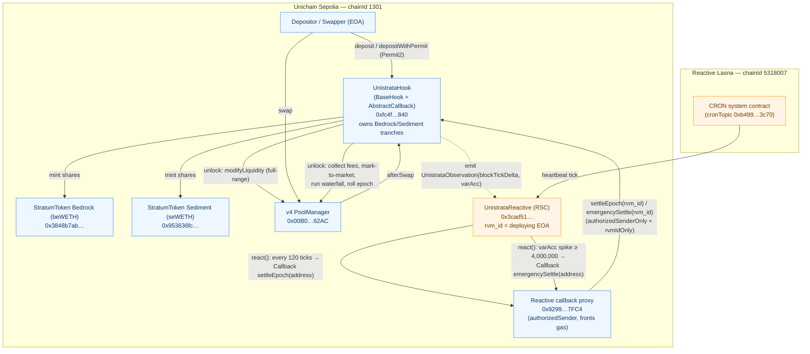

# Unistrata

**A Uniswap v4 pool, priced as a capital structure.**

> LPs are forced sellers of volatility with no buyer — impermanent loss is just the bill. **Unistrata builds the buyer.**

Unistrata is a Uniswap v4 hook that splits a single pool's impermanent loss into two tranches, the way a bond is split into senior and junior:

- **Bedrock** (senior) — protected principal, earns a **fixed coupon priced from the pool's own measured volatility**. The floor.
- **Sediment** (junior, first-loss) — underwrites the volatility, absorbs the impermanent loss, and **keeps all the excess fees**. The vol-underwriting asset.

Each epoch the structure settles through a seniority waterfall — Bedrock is paid its coupon first, Sediment takes the residual. Settlement is driven **cross-chain by a Reactive Network smart contract**: no keeper, no off-chain bot, and **no external price oracle** — the coupon is priced from realized variance the hook measures off its own tick path.

**The money shot (replayed on-chain, `sim/out/crash.json`):** tWETH falls $2,891 → $1,674 (−42%) and recovers to $2,025. Vanilla LP bleeds below HODL to impermanent loss; **Bedrock's NAV/share holds flat on its coupon line**; Sediment absorbs the drawdown, then keeps the fees on the recovery.

| | |
|---|---|
| **Live hook** | [`0xfc4f1c6aecad1507dd0ec4af4d72f62378c25840`](https://sepolia.uniscan.xyz/address/0xfc4f1c6aecad1507dd0ec4af4d72f62378c25840) · Unichain Sepolia (1301) |
| **Reactive RSC** | `0x3cad51414bbd94e19c47ef47fe2d65f89e467eea` · Reactive Lasna (5318007) |
| **Tests** | 131 passing (Foundry, TDD) incl. stateful invariants |
| **Cross-chain loop** | verified on-chain — spike → `emergencySettle` → `epochId 0→1` ([trail below](#verified-cross-chain-trail)) |
| **Frontend** | `frontend/` — Next.js + Reown AppKit + wagmi/viem, deposit via Permit2, live Reactive feed |

---

## How it works

Unistrata's mechanism lives in one hook (`src/UnistrataHook.sol`) plus three pure libraries (`src/libraries/VarianceLib.sol`, `NavLib.sol`, `WaterfallLib.sol`). The hook owns 100% of the pool's full-range liquidity; depositors hold tranche shares (`beWETH` / `seWETH`) instead of v4 positions, and external LPs are gated out (`_beforeAddLiquidity` reverts unless `sender == address(this)`). Everything below derives from the pool's own state — no external oracle.

### 1. In-pool, oracle-free variance (`varAcc`)

The hook measures realized variance straight off the pool's tick path. `afterSwap` is a permission, and `_afterSwap` reads the live tick from `getSlot0` and folds it into the accumulator through `VarianceLib.observe`:

- **One observation per block.** `observe` advances only when `currentBlock > lastObservedBlock`; otherwise it does nothing. Intra-block multi-swap sequences therefore collapse to a single block-close-to-block-close delta — the manipulation guard — and reorgs/stale blocks are no-ops (never decrement, never double-count).
- **Capped squared tick-delta.** On a new block it computes the signed delta `d = currentTick − lastObservedTick`, squares it (sign drops out), and clamps the per-block contribution at `dCap²` before adding: `newVarAcc = varAcc + min(d², dCap²)`. `dCap` is deployed at 1000, so one block contributes at most `1000² = 1e6`. This bounds the accumulator (invariant 5) and caps the influence of any single jump.
- Only on a counted observation does the hook update `(lastObservedBlock, lastObservedTick, varAcc)` and emit `UnistrataObservation(blockTickDelta, varAcc)` — the event the Reactive circuit breaker subscribes to (the deployed RSC trips at a `varAcc` spike of 4,000,000).

At settlement the per-epoch delta `varAcc − varAccAtEpochStart` is annualized: `σ² = varAcc · ln(1.0001)² · year / Δt`, where `ln(1.0001)² = LN_BASE_SQ_WAD = 9_999_000_092` turns squared *ticks* into squared *log-returns*. It rounds **up** — a larger measured σ² means a larger IL reserve and thus a lower bedrock coupon, favoring the underwriter and protocol solvency — and feeds an EWMA `sigma2Ewma`.

### 2. The variance-priced Bedrock coupon

Each epoch's fixed coupon `bedrockRate` is set in `_rollEpoch` from two EWMAs — realized variance `sigma2Ewma` and the annualized fee yield `feeYieldEwma` — via `WaterfallLib.couponRate`:

```
reserve = ceil(λ_risk · σ²_ewma / 8)        // IL reserve — the σ²/8 actuarial term
net     = max(feeYieldEwma − reserve, 0)      // saturating subtraction
r_epoch = clamp(net, rMin, rMax)
```

The **`σ²/8`** term is the actuarial heart: impermanent loss / loss-versus-rebalancing for a full-range LP scales like `σ²/8` per unit time — the cost of the short-gamma payoff a passive LP is implicitly selling. Bedrock is the *senior, protected* tranche, so its coupon is the fee yield **minus** the price of that volatility insurance, marked up by the risk loading `lambdaRisk` (deployed 1.25e18 → a 25% safety margin) and rounded up. Economically the coupon is a half-straddle priced off variance: Bedrock collects the floor, Sediment is paid (in retained excess fees) to underwrite the gamma. The result is clamped to `[rMin, rMax]` (deployed `rMax = 50% APR`); the first epoch has no history, so it floors at `rMin`.

### 3. The epoch waterfall at settlement

Settlement (`_settle`) can be triggered three ways: the Reactive heartbeat `settleEpoch(rvm_id)` (callback-only, after the epoch elapses), the Reactive volatility circuit breaker `emergencySettle(rvm_id)` (callback-only, **no time gate** — settles early to lock in the coupon before further drawdown), or a permissionless `settleEpoch()` fallback after `epochDuration + gracePeriod` so a missed callback can't brick the vault.

- **Price guard first.** `_settle` rejects settlement if the live tick deviates from the hook's own last sampled tick by more than `guardBand` (`SettlementPriceOutOfBand`). This stops settlement at a manipulated spot price.
- **Mark to market.** The hook pokes the position to realize accrued fees into idle balance, then `totalAssets()` values position + idle in the numéraire via `NavLib.valueInNumeraire` (decimals normalized to WAD). This yields `A` and `feesValue`.
- **Seniority waterfall.** `_settleWaterfall` computes the Bedrock target `sTarget = sPrev·(1 + r·Δt/year)` (accrual floored — coupon honesty, invariant 3), then `settle(A, sTarget)` does `sNew = min(A, sTarget); jNew = A − sNew`. **Bedrock is paid its coupon target first; Sediment absorbs the entire residual** — it takes the loss when `A < sTarget` and keeps all the excess when `A > sTarget`. `sNew + jNew == A` exactly (conservation, invariant 1).
- **Impairment signals.** `BedrockImpaired` fires on a true principal loss (Sediment exhausted *and* Bedrock fell below where it started); `BedrockBelowCoupon` fires when Sediment is exhausted and Bedrock grew but missed its coupon (no principal loss). `_rollEpoch` then advances `epochId`, resets the variance baseline, re-prices the coupon, and emits `EpochSettled`.

### 4. Epoch-locked withdrawals + the Permit2 deposit path

- **Queued, lockup'd exits.** `requestWithdraw(isBedrock, shares)` escrows the tranche tokens and records `eligibleEpoch = epochId + (isBedrock ? 1 : 2)`. Bedrock exits at the next settlement (+1); **Sediment is locked one epoch longer (+2)** so a junior holder cannot exit just before a volatility event it is being paid to absorb. `claim(id)` reverts until `epochId ≥ eligibleEpoch`, then pays a `value/totalAssets` slice of *all* hook assets and burns the escrowed shares — leaving remaining holders' NAV/share unchanged.
- **Deposits & shares.** `deposit` adds full-range liquidity and mints shares at the tranche's current NAV/share; the first deposit carves `DEAD_SHARES = 1000` to `0xdead` as an inflation guard. Bedrock deposits enforce the attachment cap `bedrockNav/(bedrockNav+sedimentNav) ≤ thetaMax` (deployed 0.75) — Bedrock can't grow past 75% of the structure without Sediment to back it.
- **Permit2 path.** `depositWithPermit` takes a signed `PermitBatchTransferFrom`, pulls the exact maxes via the canonical Permit2 (`0x0000…78BA3`), adds liquidity with the hook as payer, mints shares, and **refunds the unused remainder** — removing the standing unbounded-approval footgun (no resting hook allowance). Permit2 is verified live on Unichain Sepolia.

---

## Architecture

Unistrata is split across two chains. On **Unichain Sepolia (1301)** a single v4 hook owns all pool liquidity and tranches its impermanent loss into two ERC-20s. On **Reactive Lasna (5318007)** a Reactive Smart Contract (RSC) watches the hook and a CRON clock and drives settlement back through the Reactive callback proxy. No keeper, no off-chain bot, no external oracle.

### On-chain: the hook (Unichain Sepolia)

`UnistrataHook` is a `BaseHook` + `AbstractCallback` + `ReentrancyGuardTransient`. It is a **single-pool vault**: `_afterInitialize` binds it to the first pool that initializes it and reverts on any other. It deploys both `StratumToken` tranches in its constructor — **Bedrock** (`beWETH`) and **Sediment** (`seWETH`) — each owned by the hook so only it can mint/burn. It requests exactly three v4 permissions:

- `afterInitialize` — bind the pool, seed the epoch clock + variance state.
- `beforeAddLiquidity` — gate external LPs out; all liquidity flows through the hook's own `unlock` path.
- `afterSwap` — per-block realized-variance sampling; emits `UnistrataObservation` (the RSC circuit-breaker's trigger).

As an `AbstractCallback` it exposes the two Reactive entry points, both `authorizedSenderOnly` + `rvmIdOnly(rvm_id)`: `settleEpoch(rvm_id)` (heartbeat) and `emergencySettle(rvm_id)` (early spike settle). **rvm-id caveat:** the hook is CREATE2-deployed (HookMiner), so the constructor overrides `rvm_id = tx.origin` (the deploying EOA) — deploy hook and RSC from the same EOA.

### Off-chain logic, on-chain: the RSC (Reactive Lasna)

`UnistrataReactive` is an `AbstractReactive`. Its constructor registers two subscriptions (in try/catch, so one `forge script --broadcast` both deploys and subscribes):

1. **CRON heartbeat** → every `ticksPerEpoch` (120) ticks it emits a `Callback` to `settleEpoch`.
2. **`UnistrataObservation`** on the origin chain → when `varAcc − lastSpikeVarAcc ≥ spikeThreshold` (4,000,000) it emits a `Callback` to `emergencySettle`.

Each `Callback` is delivered by the **Reactive callback proxy** on Unichain Sepolia (`0x9299…7FC4`), which fronts gas and calls the hook as the authorized sender; the hook's `authorizedSenderOnly` + `rvmIdOnly` checks close the trust loop.

### Cross-chain flow



| Contract | Role | Chain |
| --- | --- | --- |
| `UnistrataHook` (`0xfc4f…840`) | Single-pool v4 hook + vault: owns full-range liquidity, prices variance from `afterSwap`, runs the waterfall, receives Reactive callbacks | Unichain Sepolia (1301) |
| `StratumToken` Bedrock / `beWETH` (`0x3848b7ab…`) | Senior tranche — protected principal + fixed variance-priced coupon | Unichain Sepolia (1301) |
| `StratumToken` Sediment / `seWETH` (`0x953636fc…`) | Junior/first-loss tranche — absorbs IL, keeps excess fees | Unichain Sepolia (1301) |
| v4 `PoolManager` (`0x00B0…62AC`) | Holds the pool; all liquidity/swap/settle goes through `unlock` | Unichain Sepolia (1301) |
| Reactive callback proxy (`0x9299…7FC4`) | Authorized sender that fronts gas and delivers RSC callbacks to the hook | Unichain Sepolia (1301) |
| `UnistrataReactive` (RSC) (`0x3cad51…`) | Subscribes to CRON + `UnistrataObservation`; emits the heartbeat + circuit-breaker callbacks | Reactive Lasna (5318007) |
| Permit2 (`0x0000…78BA3`) | Canonical signature-transfer used by `depositWithPermit` | Unichain Sepolia (1301) |

---

## Live deployment

Deployed, subscribed, funded, and **demonstrated end-to-end** on testnet. Addresses are persisted in `.env`; receipts under `broadcast/`. v4 sorts tokens by address, so on this stack **token0 = tWETH (18), token1 = tUSDC (6)**.

| Contract | Chain | Address |
|---|---|---|
| tWETH (18, token0) | Unichain Sepolia 1301 | `0x34b4626268da509c69e4cf03b92164b048fb9f8d` |
| tUSDC (6, token1, numéraire) | Unichain Sepolia 1301 | `0x5ffa4a8d379cb2471b1d4cdf2f5f2d3eca282dd6` |
| **UnistrataHook** | Unichain Sepolia 1301 | `0xfc4f1c6aecad1507dd0ec4af4d72f62378c25840` |
| Bedrock / `beWETH` | Unichain Sepolia 1301 | `0x3848b7ab1cb7d33212d28b6cf6eac9f9d65b0b8c` |
| Sediment / `seWETH` | Unichain Sepolia 1301 | `0x953636fc36a204dc2bb775fa4ca0195bf748bd0a` |
| **UnistrataReactive** (RSC) | Reactive Lasna 5318007 | `0x3cad51414bbd94e19c47ef47fe2d65f89e467eea` |

### Verified cross-chain trail

The "wow moment" — a real volatility spike, observed on-chain, routed cross-chain by the RSC, and settled back on the origin pool with **zero off-chain infrastructure**:

| Hop | Chain | Tx | What |
|---|---|---|---|
| 0. Deposit | Unichain 1301 | `0xe34f6331…5eb1` (Bedrock), `0x256b1a8d…de2d` (Sediment) | deposit into both tranches (block 54296142) |
| 1. Build variance | Unichain 1301 | 6 `--slow` swaps, blocks 54296191–197 | `varAcc` climbs 1,000,000 → 6,000,000 |
| 1b. Threshold crossing | Unichain 1301 | `0xf096b8…e52d` (block 54296197) | `UnistrataObservation` past the 4,000,000 trigger |
| 2. RSC reacts | Lasna 5318007 | RSC `0x3cad51…` | `react()` → `Callback(emergencySettle)` |
| **3. Callback lands** | Unichain 1301 | **`0x006a1a…5cd3`** (block 54296205) | `emergencySettle` → `EmergencySettled` + `EpochSettled`, `epochId 0→1` |

The Observatory screen reads this exact trail **live** from the chain via `getLogs`.

---

## Build, test & deploy

### Quickstart

```bash
forge build      # solc 0.8.34, optimizer 200 runs (hook + Permit2 path must fit the 24KB limit)
forge test       # 131 tests, 19 suites — all pass
```

Toolchain is pinned in `foundry.toml`: `evm_version = "osaka"` (cosmetic — bytecode is byte-identical to cancun), `bytecode_hash = "none"` + `cbor_metadata = false` for deterministic CREATE2 bytecode, `ffi = true` (the `.env`-writing scripts need it). The invariant profile runs `256 runs × depth 30`; CI can crank it via `FOUNDRY_INVARIANT_RUNS=10000`.

Two RPC aliases are read from the environment (`foundry.toml [rpc_endpoints]`):

| alias | chain | env var |
|---|---|---|
| `unichain_sep` | Unichain Sepolia (1301) — origin / hook home | `UNICHAIN_SEPOLIA_URL` |
| `reactive_lasna` | Reactive Lasna (5318007) — RSC home | `REACTIVE_LASNA_URL` |

### Deploy runbook (00 → 06)

All scripts live in `script/unistrata/`. Every broadcasting run uses a keystore account, not a raw key: `--account $ACCOUNT --sender $SENDER --broadcast`. Scripts persist outputs back to `.env` (`EnvWriter.upsert`) and forge auto-loads `.env`, so addresses chain forward.

| # | script | what it does | target |
|---|---|---|---|
| 00 | `00_DeployMockTokens` | Deploys demo tokens tWETH (18) + tUSDC (6); writes `TOKEN_WETH` / `TOKEN_USDC`. | `unichain_sep` |
| 01 | `01_DeployUnistrata` | HookMiner-mines the salt for the `afterInitialize\|afterSwap\|beforeAddLiquidity` flags, CREATE2-deploys the hook + PoolManager + callback proxy, then `initialize`s the pool. Decimals/ordering/numéraire derived from the real token addresses. Writes `UNISTRATA_HOOK`. | `unichain_sep` |
| 02 | `02_DeployReactive` | Deploys the RSC; its constructor registers both subscriptions (CRON + `UnistrataObservation`), so deploying **is** subscribing. `TICKS_PER_EPOCH=120`, `SPIKE_THRESHOLD=4,000,000`, `CALLBACK_GAS_LIMIT=1,000,000`. Writes `UNISTRATA_REACTIVE`. | `reactive_lasna` |
| 03 | `03_FundAndSubscribe` | Funds the hook (via the proxy's `depositTo`) on the origin chain and the RSC on Lasna — both chains in one invocation. | both |
| 04 | `04_DepositDemo` | Mints (permissionless `DemoERC20`) + approves, deposits into both tranches — **Sediment first**, then Bedrock, so the attachment cap holds. | `unichain_sep` |
| 05 | `05_SpikeSwaps` | N=6 large alternating swaps (> `dCap`) to build variance and trip the circuit breaker. **MUST run `--slow`** (see gotchas). | `unichain_sep` |
| 06 | `06_SpikeStep` | `--slow`-free alternative: one variance-building swap per invocation; self-syncs off the hook's on-chain `lastObservedTick`. | `unichain_sep` |

Once cumulative `varAcc ≥ 4,000,000`, the RSC's `react()` fires `emergencySettle` back to the hook cross-chain (~1–3 min), bumping `epochId`.

### Foundry invariants (brief §6)

- **Conservation (1):** `bedrockNav + sedimentNav ≈ totalAssets` post-settle (within dust).
- **Seniority (2):** Bedrock NAV/share is non-decreasing while Sediment retains coverage — Sediment is first-loss.
- **Coupon honesty (3):** `rMin ≤ bedrockRate() ≤ rMax` at all times.
- **varAcc bound (5):** cumulative `varAcc ≤ (elapsed blocks)·dCap²`.
- **Access control (6):** `settleEpoch(rvm_id)`/`emergencySettle(rvm_id)` are gated by `authorizedSenderOnly` **and** `rvmIdOnly`; the permissionless fallback only succeeds after epoch + grace.

### Two gotchas (cost hours — read twice)

1. **`rvm_id` must equal the deploying EOA.** The hook is CREATE2-deployed, so `AbstractCallback`'s default `rvm_id = msg.sender` would be the factory. The constructor overrides it to `tx.origin`. Deploy hook and RSC from the **same EOA**, or every cross-chain callback reverts `"Authorized RVM ID only"`.
2. **Spike swaps need `--slow` (script 05).** The hook accumulates `varAcc` only when `block.number` advances; without `--slow`, forge lands all swaps in one block → one observation. `--slow` awaits each receipt so each swap gets its own block. (Script 06 sidesteps this.)

---

## Frontend

A single-page **Next.js 14 (App Router, TypeScript)** app in `frontend/`, wired to the live hook through **Reown AppKit + wagmi/viem**, with **bun** as the package manager. One network — Unichain Sepolia (1301); reads go through Reown's default blockchain-API proxy (it serves both `eth_call` and the chunked `getLogs` feed).

- **Thesis / Landing** — the pitch: hero, the live capital-structure `StrataCore` visual, four live metric tiles (`useHookState`), and the crash-scenario money chart from real `sim/out` data. An honest `live` / `verified snapshot` badge reflects whether the RPC reads actually succeeded.
- **Deposit** — *fully live, Permit2-based.* A permissionless faucet mints test tokens; depositing is a one-time `approve` to the audited **Permit2** (never a standing hook allowance) → a signed `PermitBatchTransferFrom` (exact amounts, hook as spender, deadline) → `depositWithPermit`. The hook pulls the exact maxes, mints shares, refunds the rest. Legs are mapped to `currency0`/`currency1` by token identity so a re-sort can't mis-order the batch.
- **Withdraw** — *live, epoch-locked.* `requestWithdraw` / `claim` with the +1/+2 lockup; the queue is reconstructed live from `WithdrawRequested` − `WithdrawClaimed` logs.
- **Observatory** — the live cockpit: hook reads every 30s, a `varAcc`-vs-trigger gauge, a real epoch countdown (`epochStart + epochDuration`), and a **live on-chain event feed** (`useHookEvents`, chunked tip-first `getLogs`) showing the real `EpochSettled` / `EmergencySettled` / `UnistrataObservation` / `Deposit` trail.
- **Simulator** — replays the real Phase-5 `sim/out` scenarios (calm / trend / crash): scrub the epochs and watch the money chart and capital structure move in sync.

```bash
cd frontend
bun install
bun run dev      # http://localhost:3000   (bun run build for production)
```

Env (`.env.example`): `NEXT_PUBLIC_REOWN_PROJECT_ID` (from dashboard.reown.com; wallet connect is off until set) and `NEXT_PUBLIC_UNICHAIN_RPC` (defaults to `https://sepolia.unichain.org`). All on-chain addresses are pinned in `lib/contracts.ts`.

---

## Demo video storyboard (≈3 min)

1. **0:00–0:25 — Problem.** "LPs are forced sellers of volatility with no buyer. IL is just the bill." Show the money chart: vanilla LP bleeding below HODL.
2. **0:25–1:00 — Idea.** The capital-structure framing. Open the Landing → Observatory `StrataCore`: Bedrock at the bottom (protected), Sediment on top (first-loss).
3. **1:00–2:00 — Live mechanism.** Simulator → replay the **crash** scenario: price swings 42%, the variance gauge climbs, the Sediment layer visibly compresses while the Bedrock NAV line stays flat on its coupon track. Then the Observatory **live feed**: the real spike → RSC → `emergencySettle` callback, with Uniscan links on screen.
4. **2:00–2:40 — Why it matters.** Sustainable on-chain fixed income sized off an honest, oracle-free risk measure; Sediment as a new vol-underwriting asset class; zero keeper infrastructure.
5. **2:40–3:00 — Traction surface.** The real Permit2 deposit flow on testnet, the addresses, the repo. "Every parameter is a governance dial; every pool can have a capital structure."

---

## How this maps to judging

| Criterion | Where we earn it |
|---|---|
| **Original idea** | Tranching IL + an in-pool variance oracle + a variance-priced coupon — a new primitive, not an integration |
| **Unique execution** | Oracle-free σ² from tick deltas; σ²/8 actuarial pricing; keeper-less Reactive automation; epoch waterfall |
| **Impact** | Fixed income for passive LPs + a tradeable vol-underwriting asset; works for any v4 pool |
| **Functionality** | Invariant-tested waterfall (131 tests); end-to-end testnet run with real cross-chain RSC callbacks |
| **Presentation** | The money chart + the live layered visualization + the live Reactive feed |
| **Reactive sponsor track** | Idiomatic RSC: subscriptions, callback-proxy auth, funding, CRON + event-driven triggers, recorded cross-chain tx trail |

---

## Submission checklist

- [x] Uniswap v4 hook, invariant-tested — **131 tests pass** (`forge test`)
- [x] Deployed live on Unichain Sepolia + Reactive Lasna (addresses above, in `.env` / `broadcast/`)
- [x] Cross-chain settlement loop **verified on-chain** (spike → `emergencySettle` → `epochId 0→1`)
- [x] Reactive sponsor track: subscriptions + callback-proxy auth + CRON & event triggers + funded + recorded trail (`REACTIVE.md`)
- [x] Frontend live on testnet — Permit2 deposit, withdraw, live Reactive feed (`frontend/`)
- [x] Money chart from real on-chain simulation replays (`sim/out/`)
- [ ] Demo video recorded to the storyboard above
- [ ] Submission form: repo link, addresses, video

---

## Repo layout

```
src/
  UnistrataHook.sol            # the hook: vault, variance, waterfall, Reactive callbacks
  StratumToken.sol             # the beWETH / seWETH tranche share token
  libraries/{VarianceLib,NavLib,WaterfallLib}.sol
  reactive/UnistrataReactive.sol   # the RSC (CRON heartbeat + volatility circuit breaker)
script/unistrata/              # 00_DeployMockTokens … 06_SpikeStep deploy runbook
test/                          # 131 tests incl. stateful invariants
sim/                           # Phase-5 scenario replays → sim/out/*.json (the money chart)
frontend/                      # Next.js + Reown AppKit + wagmi/viem (bun)
REACTIVE.md  PROGRESS.md        # Reactive integration notes + build log
```

---

Built on the [Uniswap v4 Hook Template](https://github.com/Uniswap/v4-template). See `UNISTRATA_BUILD_BRIEF.md` for the full product spec, `REACTIVE.md` for the Reactive Network integration, and `PROGRESS.md` for the build log.
